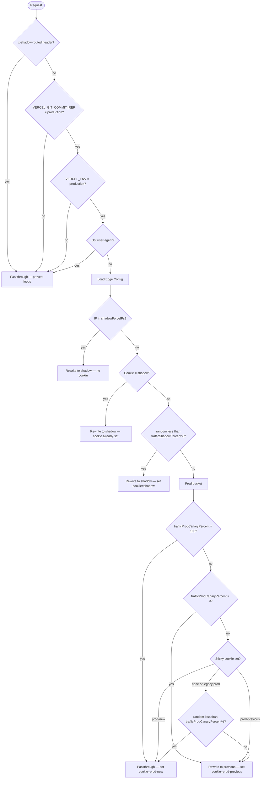

import { Aside } from '@astrojs/starlight/components';

The middleware runs on every request that matches the route pattern. It makes one routing decision per request and either passes through to the current deploy or rewrites to a different deploy URL.

## Decision tree

## Early exits

The middleware exits immediately (passthrough to current deploy) in four cases:

1. **`x-shadow-routed: 1` header present** — The request was already rewritten by the middleware on another deploy. This prevents routing loops: when the middleware rewrites to the shadow URL, the shadow deploy's middleware sees the header and skips routing.

2. **Not on the `production` branch** — `VERCEL_GIT_COMMIT_REF` is checked at runtime. Shadow and previous-prod deploys receive this header as `master` or a commit SHA, so they skip routing entirely. Only the production-branch deploy routes traffic.

3. **Not in production environment** — Preview deploys (`VERCEL_ENV = preview`) serve their own content without routing.

4. **Bot user-agent** — The pattern `/bot|crawl|spider|scraper|headless|preview/i` matches. Bots and crawlers are never routed to shadow or previous deploys.

## Shadow bucket

After the early exits, the middleware checks whether the request should go to the shadow deploy:

1. **IP allowlist** — If the client IP is in `shadowForceIPs`, the request goes to shadow immediately, with no cookie set. IP-forced routing bypasses cookie stickiness. This is useful for routing office traffic to shadow.

2. **Sticky cookie** — If `shadow-bucket=shadow` is set, the request goes to shadow. The user was previously assigned and stays assigned for 24 hours.

3. **Random roll** — If neither applies and the user has no prod-bucket cookie, a fresh roll is taken. If `random() * 100 < trafficShadowPercent` (typically 1), the user goes to shadow and receives the `shadow-bucket=shadow` cookie.

## Prod bucket

If the request is not routed to shadow, it enters the prod bucket. The prod bucket is further split between the new prod deploy and the previous prod deploy (canary).

The decision logic:

| Condition | Result |
|---|---|
| No `deploymentDomainProdPrevious` in config | Always new prod |
| `trafficProdCanaryPercent = 0` | Always previous prod |
| Cookie is `prod-new` | New prod (sticky) |
| Cookie is `prod-previous` | Previous prod (sticky) |
| `trafficProdCanaryPercent = 100` | Always new prod |
| No sticky cookie | Fresh roll: `random() < canaryPct` → new, else previous |

Legacy `prod-bucket=prod` cookies (from before canary support was added) are treated as "prod bucket, no sub-bucket" — a fresh roll is taken and the cookie is upgraded to `prod-new` or `prod-previous`.

## Cookie values

| Value | Meaning | TTL |
|---|---|---|
| `shadow` | User assigned to shadow (master) deploy | 24 hours |
| `prod-new` | User assigned to current production deploy | 24 hours |
| `prod-previous` | User assigned to previous production deploy | 24 hours |

Cookie name: `shadow-bucket`. Set with `SameSite=Lax`, `Path=/`.

<Aside type="tip">
Sessions sticky to `prod-previous` survive the canary completing at 100%. Those users finish their journey on the previous deploy until the next `deploy-prod` run overwrites `deploymentDomainProdPrevious`. This keeps in-flight checkouts and payment tunnels on a stable version.
</Aside>

## Skew Protection role

Skew Protection (Vercel Pro/Enterprise) ensures that static assets requested by a specific deploy URL are served from that same deploy. Without it, a user on the new prod deploy might load JS chunks from the previous deploy's CDN path, or vice versa — causing `ChunkLoadError` or hydration mismatches.

With Skew Protection, Vercel injects `?dpl=<deploymentId>` on asset URLs at build time. Cross-deploy rewrites still work because the middleware sets the `x-shadow-routed` header before rewriting, so the target deploy's middleware passes through and serves its own assets correctly.

## Edge Config caching

The middleware caches the Edge Config response in module-level memory for 60 seconds (`CACHE_TTL_MS`). Vercel's Fluid Compute keeps middleware instances warm across invocations, so one instance reads Edge Config once and serves thousands of requests from RAM.

This means config changes (adding an IP to `shadowForceIPs`, bumping `trafficShadowPercent`) take up to 60 seconds to propagate to all warm instances. This is intentional — it trades a short propagation delay for a dramatic reduction in Edge Config API calls.

---

**Related:**
- [Shadow vs Canary](/shadow-canary/concepts/shadow-vs-canary/) — the two mechanisms explained
- [Edge Config](/shadow-canary/concepts/edge-config/) — the config schema the middleware reads
- [Troubleshooting](/shadow-canary/ops/troubleshooting/) — common routing issues and fixes
