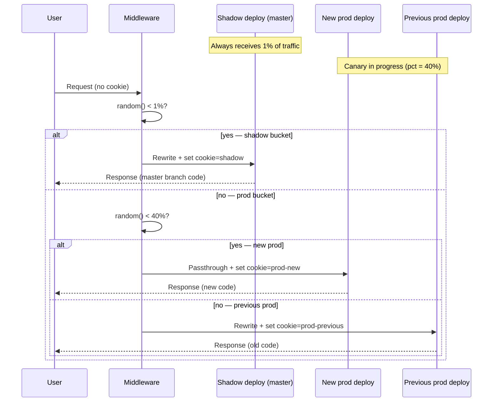

Shadow-canary combines two distinct traffic-splitting mechanisms. Understanding each one separately makes it easier to operate the system.

## The two mechanisms

| | Shadow | Canary |
|---|---|---|
| **Branch** | `master` | `production` |
| **Traffic share** | Fixed 1% | 0% → 100% ramp |
| **Duration** | Permanent — always on | Ephemeral — active during a release |
| **Purpose** | Catch regressions before promoting | Safely promote a new release |
| **Rollback** | Kill-switch via Edge Config | Auto-rollback on SLO failure |
| **Cookie value** | `shadow` | `prod-new` or `prod-previous` |

## Shadow: the permanent 1%

Every push to `master` ships a new shadow deploy. The middleware routes approximately 1% of production traffic to the shadow deploy, permanently. This gives you:

- Continuous real-traffic testing of your latest code before it is promoted
- Regression detection before the production merge
- A live canary for infrastructure changes (dependencies, Next.js upgrades) that are not yet in `production`

The 1% is configurable via `trafficShadowPercent` in Edge Config. Setting it to `0` is the kill-switch — the shadow deploy still exists but receives no traffic.

Shadow users get a sticky `shadow-bucket=shadow` cookie (24-hour TTL). If a user is assigned to shadow, they stay on shadow for the session. IP allowlist entries bypass this — they go straight to shadow with no cookie.

## Canary: the ephemeral ramp

A canary starts when `master` merges into `production`. The workflow:

1. Deploys the new `production` code and preserves the current prod URL as `deploymentDomainProdPrevious`
2. Sets `trafficProdCanaryPercent` to `0` — all prod traffic goes to the previous deploy
3. Every 15 minutes, the cron checks `/api/slo` on the new deploy twice
4. If both checks pass, increments `trafficProdCanaryPercent` by 4 (configurable)
5. At 100%, new users go straight to the new deploy; sessions already on `prod-previous` finish their journey there

A canary ends when `trafficProdCanaryPercent` reaches 100, or when the next `deploy-prod.yml` run overwrites the previous URL.

## Swim-lane diagram

## Why both

Shadow alone tells you whether the new code works under real traffic before you promote. Canary gives you a controlled rollout path after promotion.

Together they form a release pipeline where:
1. Every `master` push is tested live at 1%
2. Every `production` merge starts at 0% and ramps gradually
3. A bad release is caught either by the shadow (before promotion) or by the SLO check (after promotion but early in the ramp)

The sticky cookie ensures users do not experience multiple versions in a single session, which matters for checkout flows, authentication, and any stateful interaction.

---

**Next:**
- [Routing](/shadow-canary/concepts/routing/) — the full middleware decision tree
- [Edge Config](/shadow-canary/concepts/edge-config/) — the configuration key that drives both mechanisms
