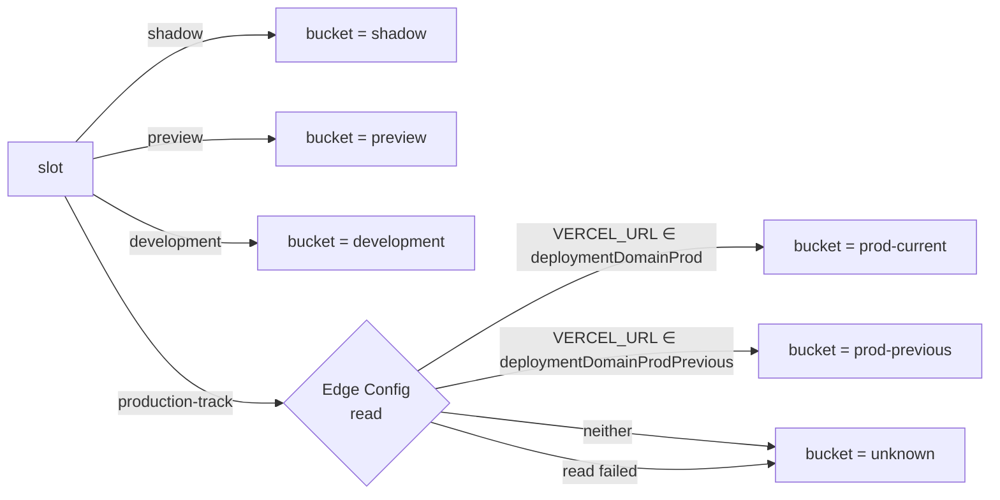

import { Aside, Tabs, TabItem } from '@astrojs/starlight/components';

`@dotworld/shadow-canary-core` exposes two helpers that tell the running code **where it lives** — which deploy slot, which commit, which branch — so you can tag every Sentry error, PostHog event, log line, or debug header with that context.

This is the missing piece for canary observability: when a release breaks, you need to know whether the broken request hit `prod-current` (your new deploy), `prod-previous` (the safety net), `shadow` (the parallel master deploy), or a preview. Otherwise the SLO check just tells you "something is failing" with no anchor.

## Two layers

| Helper | Sync? | Reads Edge Config? | Returns |
|---|---|---|---|
| `getBuildInfo()` | ✅ sync | ❌ no | Coarse `slot` + git/Vercel env metadata |
| `getRuntimeBucket()` | ⏳ async | ✅ yes | Same + narrowed `bucket` (`prod-current` vs `prod-previous`) |

The split exists because **build env vars cannot tell `prod-current` from `prod-previous`** — both share `VERCEL_ENV=production` and the same production branch. Edge Config is the only source of truth for which is which (the admin UI promotes / rolls back by swapping `deploymentDomainProd` and `deploymentDomainProdPrevious`).

Use `getBuildInfo()` when you only need build metadata (commit, branch, region) — typical for `Sentry.init` config. Use `getRuntimeBucket()` when you need to discriminate the two prod tracks — typical for per-event tagging in PostHog.

## `getBuildInfo()` — sync, no I/O

```ts
import { getBuildInfo } from '@dotworld/shadow-canary-core';

const info = getBuildInfo();
// {
//   vercelEnv:        'production',
//   region:           'iad1',
//   deploymentId:     'dpl_FupoRk57dHM4BQVMmyzDVmXmRSuA',
//   vercelUrl:        'my-app-abc.vercel.app',
//   branchUrl:        'my-app-git-production-team.vercel.app',
//   branch:           'production',
//   commitSha:        'abc1234567890abcdef...',
//   commitShaShort:   'abc1234',
//   commitMessage:    'feat: ship the thing',
//   commitAuthor:     'Jane Dev',
//   repoSlug:         'shadow-canary',
//   slot:             'production-track',
// }
```

The `slot` field is the coarse classification:

| `slot` | When |
|---|---|
| `shadow` | `VERCEL_ENV=production`, branch ≠ `productionBranch` (master deploy) |
| `production-track` | `VERCEL_ENV=production`, branch === `productionBranch` (could be current OR previous) |
| `preview` | `VERCEL_ENV=preview` (PR / non-prod branch) |
| `development` | `VERCEL_ENV` unset (local `next dev`) |
| `unknown` | Unexpected combination |

`productionBranch` defaults to `SHADOW_CANARY_PRODUCTION_BRANCH` env var, then `'production'` — same convention as the middleware.

## `getRuntimeBucket()` — async, queries Edge Config

```ts
import { getRuntimeBucket } from '@dotworld/shadow-canary-core';

const info = await getRuntimeBucket();
// All BuildInfo fields, plus:
// {
//   bucket: 'prod-current' | 'prod-previous' | 'shadow' | 'preview' | 'development' | 'unknown',
//   resolvedFromEdgeConfig: true,
// }
```

Resolution logic:



Edge Config is cached for 60 seconds by the underlying reader, so calling `getRuntimeBucket()` once per request on a warm instance is a memory lookup, not a network call.

<Aside type="note">
`getRuntimeBucket()` is edge-runtime safe. It uses the same `getShadowConfig()` reader as the middleware, so import it from either entry point — `@dotworld/shadow-canary-core` (Node) or `@dotworld/shadow-canary-core/edge`.
</Aside>

## Recipes

### Sentry — release tracking & per-bucket dashboards

Stamp every error with the current commit (release) and slot (environment). Sentry's "Releases" UI then shows whether errors clustered around a specific deploy, and the `bucket` tag lets you filter "errors in `prod-current` only" to confirm a canary regression.

<Tabs>
<TabItem label="Server (sentry.server.config.ts)">

```ts
import * as Sentry from '@sentry/nextjs';
import { getBuildInfo } from '@dotworld/shadow-canary-core';

const info = getBuildInfo();

Sentry.init({
  dsn: process.env.SENTRY_DSN,
  // Releases are keyed by commit — every push gets its own release page.
  release: info.commitSha ?? undefined,
  // Environments are coarse: separate `production-track` from `shadow` so
  // dashboards split correctly. Use `bucket` instead via initialScope below
  // if you want prod-current vs prod-previous separation.
  environment: info.slot,
  initialScope: {
    tags: {
      'shadow-canary.slot': info.slot,
      'shadow-canary.branch': info.branch ?? 'unknown',
      'vercel.region': info.region ?? 'unknown',
      'vercel.deployment_id': info.deploymentId ?? 'unknown',
    },
  },
});
```

</TabItem>
<TabItem label="Server with bucket disambiguation">

```ts
// Sentry.init must run synchronously, but you can refine the scope per
// request once Edge Config has resolved the bucket.
import * as Sentry from '@sentry/nextjs';
import { getRuntimeBucket } from '@dotworld/shadow-canary-core';

export async function tagSentryWithBucket(): Promise<void> {
  const info = await getRuntimeBucket();
  Sentry.getCurrentScope().setTags({
    'shadow-canary.slot': info.slot,
    'shadow-canary.bucket': info.bucket, // prod-current | prod-previous | ...
  });
}

// Call this from instrumentation.ts onRequestError or a route's first await.
```

</TabItem>
<TabItem label="Client (sentry.client.config.ts)">

```ts
// Client-side: env vars aren't available, so inject build info from a
// server-rendered <script> in your root layout (see "Surfacing to the
// client" below) and read it from window.
import * as Sentry from '@sentry/nextjs';

declare global {
  interface Window {
    __SHADOW_CANARY__?: import('@dotworld/shadow-canary-core').BuildInfo;
  }
}

const info = window.__SHADOW_CANARY__;

Sentry.init({
  dsn: process.env.NEXT_PUBLIC_SENTRY_DSN,
  release: info?.commitSha ?? undefined,
  environment: info?.slot ?? 'unknown',
  initialScope: {
    tags: {
      'shadow-canary.slot': info?.slot ?? 'unknown',
      'shadow-canary.branch': info?.branch ?? 'unknown',
    },
  },
});
```

</TabItem>
</Tabs>

**Why this matters during a canary**: when `trafficProdCanaryPercent: 25`, ~25% of prod traffic hits `bucket=prod-current` and 75% hits `bucket=prod-previous`. If errors-per-million spike on `prod-current` only and stay flat on `prod-previous`, the new deploy is the cause — Sentry's "Issues" view filtered by `bucket:prod-current` gives you the stack traces in seconds. Without this tag, you'd see a global error rate increase but couldn't anchor it to the new code.

### PostHog — per-event slot/bucket properties

Stamp every captured event with bucket info so funnels and feature flag analyses can split by deploy.

<Tabs>
<TabItem label="Server (Node SDK)">

```ts
import { PostHog } from 'posthog-node';
import { getRuntimeBucket } from '@dotworld/shadow-canary-core';

const posthog = new PostHog(process.env.POSTHOG_KEY!, {
  host: 'https://eu.posthog.com',
});

export async function captureWithBucket(
  distinctId: string,
  event: string,
  properties: Record<string, unknown> = {},
): Promise<void> {
  const info = await getRuntimeBucket();
  posthog.capture({
    distinctId,
    event,
    properties: {
      ...properties,
      $set_once: {
        // Per-distinctId one-time fields — first deploy a user saw.
        first_seen_release: info.commitShaShort,
      },
      // Per-event fields — survive into every event for cohorting.
      'shadow-canary.slot': info.slot,
      'shadow-canary.bucket': info.bucket,
      'shadow-canary.branch': info.branch,
      'shadow-canary.commit': info.commitShaShort,
    },
  });
}
```

</TabItem>
<TabItem label="Client (posthog-js)">

```ts
// app/providers.tsx
'use client';

import posthog from 'posthog-js';
import { useEffect } from 'react';
import type { BuildInfo } from '@dotworld/shadow-canary-core';

export function PostHogProvider({
  children,
  buildInfo,
}: {
  children: React.ReactNode;
  buildInfo: BuildInfo;
}) {
  useEffect(() => {
    posthog.init(process.env.NEXT_PUBLIC_POSTHOG_KEY!, {
      api_host: 'https://eu.posthog.com',
      // register() merges into every captured event automatically.
      loaded: (ph) => {
        ph.register({
          'shadow-canary.slot': buildInfo.slot,
          'shadow-canary.branch': buildInfo.branch,
          'shadow-canary.commit': buildInfo.commitShaShort,
          'shadow-canary.deployment_id': buildInfo.deploymentId,
        });
      },
    });
  }, [buildInfo]);

  return <>{children}</>;
}
```

```tsx
// app/layout.tsx
import { getBuildInfo } from '@dotworld/shadow-canary-core';
import { PostHogProvider } from './providers';

export default function RootLayout({ children }: { children: React.ReactNode }) {
  return (
    <html>
      <body>
        <PostHogProvider buildInfo={getBuildInfo()}>{children}</PostHogProvider>
      </body>
    </html>
  );
}
```

</TabItem>
</Tabs>

**Useful PostHog queries** once events carry the bucket property:

- **Conversion-rate diff**: funnel `signup → activate`, breakdown by `shadow-canary.bucket` — direct comparison of new prod vs previous prod on the same metric, same time window.
- **Feature flag interaction**: when running a PostHog feature flag during a canary, breakdown by `bucket × variant` to be sure the flag rollout isn't confounded with the deploy rollout.
- **Cohort tagged "first seen on broken release"**: filter events where `first_seen_release == 'abc1234'` — useful for damage assessment after a rollback.

## Surfacing build info to the client

Vercel env vars exist only on the server. To make `BuildInfo` available to client components (e.g. for the PostHog `register()` call above, or a debug badge), inject it from a server component.

### Pattern A — Server component → prop

```tsx
// app/layout.tsx (server component)
import { getBuildInfo } from '@dotworld/shadow-canary-core';
import { ClientShell } from './client-shell';

export default function RootLayout({ children }: { children: React.ReactNode }) {
  return <ClientShell buildInfo={getBuildInfo()}>{children}</ClientShell>;
}
```

The `BuildInfo` object is JSON-serializable, so it crosses the server/client boundary fine.

### Pattern B — Inline `<script>` for global access

```tsx
// app/layout.tsx
import { getBuildInfo } from '@dotworld/shadow-canary-core';

export default function RootLayout({ children }: { children: React.ReactNode }) {
  const info = getBuildInfo();
  return (
    <html>
      <head>
        <script
          dangerouslySetInnerHTML={{
            __html: `window.__SHADOW_CANARY__ = ${JSON.stringify(info)};`,
          }}
        />
      </head>
      <body>{children}</body>
    </html>
  );
}
```

Use this when third-party scripts (Sentry's `sentry.client.config.ts`, `posthog-js` bootstrap) need to read it before any React component mounts.

### Pattern C — API route

```ts
// app/api/shadow-canary/info/route.ts
import { NextResponse } from 'next/server';
import { getRuntimeBucket } from '@dotworld/shadow-canary-core';

export async function GET() {
  return NextResponse.json(await getRuntimeBucket());
}
```

Convenient for a debug page or CLI probe, but adds a network hop — prefer A or B for telemetry init.

## Other surfaces

### Response header (debug)

```ts
// instrumentation.ts or a middleware
import { formatBuildInfoTag, getBuildInfo } from '@dotworld/shadow-canary-core/edge';

const tag = formatBuildInfoTag(getBuildInfo());
// '[production-track @ production abc1234]'

response.headers.set('x-shadow-canary', tag);
```

`curl -I` against your prod URL during a canary to immediately see `x-shadow-canary: [production-track @ production abc1234]` vs the previous deploy's tag — quick smoke test that the routing knob actually moved traffic.

### Structured logs

```ts
import { getBuildInfo } from '@dotworld/shadow-canary-core';

const info = getBuildInfo();

console.log(JSON.stringify({
  level: 'error',
  msg: 'payment failed',
  err: err.message,
  slot: info.slot,
  commit: info.commitShaShort,
  region: info.region,
}));
```

Vercel's log drain forwards these to Datadog / Loki / etc. with the slot/commit fields searchable — you can filter "errors with `slot=shadow`" to triage the parallel deploy without polluting the prod dashboard.

## Reference

### `BuildInfo`

| Field | Type | Source |
|---|---|---|
| `vercelEnv` | `'production' \| 'preview' \| 'development' \| null` | `VERCEL_ENV` |
| `region` | `string \| null` | `VERCEL_REGION` |
| `deploymentId` | `string \| null` | `VERCEL_DEPLOYMENT_ID` |
| `vercelUrl` | `string \| null` | `VERCEL_URL` |
| `branchUrl` | `string \| null` | `VERCEL_BRANCH_URL` |
| `branch` | `string \| null` | `VERCEL_GIT_COMMIT_REF` |
| `commitSha` | `string \| null` | `VERCEL_GIT_COMMIT_SHA` |
| `commitShaShort` | `string \| null` | First 7 chars of `commitSha` |
| `commitMessage` | `string \| null` | First line of `VERCEL_GIT_COMMIT_MESSAGE` |
| `commitAuthor` | `string \| null` | `VERCEL_GIT_COMMIT_AUTHOR_NAME` |
| `repoSlug` | `string \| null` | `VERCEL_GIT_REPO_SLUG` |
| `slot` | `ShadowCanarySlot` | Derived |

### `RuntimeInfo`

Extends `BuildInfo` with:

| Field | Type | Notes |
|---|---|---|
| `bucket` | `ShadowCanaryBucket` | Narrowed via Edge Config |
| `resolvedFromEdgeConfig` | `boolean` | `true` only if Edge Config was read AND succeeded |

### Options

```ts
type GetBuildInfoOptions = {
  productionBranch?: string;
  // default: process.env.SHADOW_CANARY_PRODUCTION_BRANCH ?? 'production'
  // pass '' to disable the branch filter
};
```
