import { Aside } from '@astrojs/starlight/components';

Shadow-canary ships three GitHub Actions workflows. Each workflow has a single, clear responsibility.

## deploy-shadow.yml

**Trigger:** Push to `master`, or manual `workflow_dispatch`.

**Responsibility:** Deploy the `master` branch to Vercel and update `deploymentDomainShadow` in Edge Config.

### Steps

1. Checkout the repository
2. Install the Vercel CLI
3. Run `vercel deploy --prod --skip-domain` — this deploys without aliasing to the custom domain
4. Read the current `shadow-configuration` from Edge Config
5. Merge the new shadow URL into the config (upsert), preserving all other fields

### Secrets required

| Secret | Used for |
|---|---|
| `VERCEL_TOKEN` | Authenticating with Vercel CLI and REST API |
| `VERCEL_ORG_ID` | Scoping Vercel API calls to the correct team |
| `VERCEL_PROJECT_ID` | Deploying to the correct project |
| `VERCEL_EDGE_CONFIG_ID` | Reading and writing the Edge Config store |

### Edge Config mutations

Sets `deploymentDomainShadow` to the new deploy URL. Initializes `deploymentDomainProd`, `trafficShadowPercent`, `trafficProdCanaryPercent`, and `shadowForceIPs` if they are absent.

### Customization

To change the shadow traffic percentage from 1%, edit `shadow-configuration` in the Edge Config directly — this workflow does not reset it. To permanently change the default, modify the `jq` merge expression in the workflow.

---

## deploy-prod.yml

**Trigger:** Push to `production`, or manual `workflow_dispatch` (with optional `skip_canary` and `keep_canary` boolean inputs).

**Responsibility:** Deploy the `production` branch, promote it to the custom domain, and set up the canary state in Edge Config.

### Steps

1. Checkout the repository
2. Install the Vercel CLI
3. Run `vercel deploy --prod --skip-domain` — builds the new production deploy
4. Run `vercel promote <url>` — aliases the new deploy to the custom domain
5. Read current Edge Config, determine the mode (normal canary, `[skip-canary]`, `[keep-canary]`)
6. Write the updated config to Edge Config
7. Notify Slack (if `SLACK_WEBHOOK_URL` is set)

### Commit markers

| Marker in commit message | Effect |
|---|---|
| _(none)_ | Standard canary: sets `trafficProdCanaryPercent: 0`, saves old URL as `deploymentDomainProdPrevious`, sets `canaryStartedAt` |
| `[skip-canary]` | Direct promote: sets `trafficProdCanaryPercent: 100`, clears `deploymentDomainProdPrevious` and `canaryStartedAt` |
| `[keep-canary]` | Fix-in-place: replaces `deploymentDomainProd` but keeps `trafficProdCanaryPercent`, `deploymentDomainProdPrevious`, and `canaryStartedAt` |

The same options are available via `workflow_dispatch` inputs `skip_canary` and `keep_canary`.

### Secrets required

Same as `deploy-shadow.yml`, plus `SLACK_WEBHOOK_URL` (optional).

### Edge Config mutations

| Mode | Fields written |
|---|---|
| Normal canary | `deploymentDomainProd`, `deploymentDomainProdPrevious`, `trafficProdCanaryPercent=0`, `canaryStartedAt`, `canaryPaused=false` |
| `[skip-canary]` | `deploymentDomainProd`, `trafficProdCanaryPercent=100`, deletes `deploymentDomainProdPrevious` and `canaryStartedAt` |
| `[keep-canary]` | `deploymentDomainProd` only — ramp state preserved |

### Bootstrap behavior

On the very first `deploy-prod.yml` run, `deploymentDomainProd` is empty in Edge Config. The workflow detects this and goes straight to `trafficProdCanaryPercent: 100` — there is no previous prod to fall back to.

<Aside type="tip">
Alternatively, use `[skip-canary]` on your first production push to make the intent explicit.
</Aside>

---

## canary-ramp.yml

**Trigger:** Cron `*/15 * * * *` (every 15 minutes), or manual `workflow_dispatch`.

**Responsibility:** Check the SLO on the new prod deploy and bump `trafficProdCanaryPercent` by 4 points if healthy, or rollback to 0 and pause if unhealthy.

### Steps

1. Read current canary state from Edge Config
2. Skip if: no `deploymentDomainProd`, `trafficProdCanaryPercent = 100`, or `canaryPaused = true`
3. Call `GET {deploymentDomainProd}/api/slo` twice, 30 seconds apart
4. If both return HTTP 200: compute next percentage and apply bump
5. If either check fails: rollback to 0%, set `canaryPaused: true`, notify Slack

### Ramp curve (Europe/Paris)

```mermaid
gantt
    title Canary ramp curve (Europe/Paris)
    dateFormat HH:mm
    axisFormat %H:%M
    section Morning cap 20%
    0% to 20% max     :08:00, 4h
    section Afternoon ramp
    20% to 100%       :12:00, 5h
```

- Before 12:00 Paris time: the cap is 20%. Each tick adds 4 points but will not exceed 20. This prevents a overnight cron (which runs even if you did not plan for it) from ramping to 100% while nobody is watching.
- From 12:00 onward: cap lifts to 100%. Each 15-minute tick adds 4 points. The ramp completes at approximately 17:00 (5 hours × 4 points × 4 ticks/hour = 80 points from 20% to 100%).

### Concurrency

The workflow uses `concurrency: group: canary-ramp, cancel-in-progress: false`. If a manual trigger races with the scheduled trigger, neither is cancelled — both complete. Because the Edge Config read-compute-write is not atomic, a race can theoretically write the same bump twice. In practice this is harmless (duplicate bump → next tick is just lower).

### Customization

**Change the step size:** Edit the `STEP` env var at the top of the workflow (default: `4`).

**Change the time zone:** Replace `TZ=Europe/Paris` in the `date` command.

**Change the morning cap:** Edit the `if [ "$HOUR" -lt 12 ]; then CAP=20` condition.

**Change the frequency:** Edit the cron expression. Changing from `*/15` to `*/30` halves the number of GitHub Actions minutes consumed.

**Change the SLO endpoint:** The URL is `${{ steps.state.outputs.prod_url }}/api/slo`. Edit the step to use a different path.

### Secrets required

| Secret | Used for |
|---|---|
| `VERCEL_TOKEN` | Reading and writing Edge Config |
| `VERCEL_ORG_ID` | Scoping Edge Config API calls |
| `VERCEL_EDGE_CONFIG_ID` | Identifying the store |
| `SLACK_WEBHOOK_URL` | Rollback and completion notifications (optional) |

Note: `VERCEL_PROJECT_ID` is not needed by `canary-ramp.yml` — it does not deploy anything.

---

**Related:**
- [Edge Config](/shadow-canary/concepts/edge-config/) — the fields these workflows write
- [SLO integration](/shadow-canary/reference/slo-integration/) — replacing the stub `/api/slo`
- [Troubleshooting](/shadow-canary/ops/troubleshooting/) — common workflow failures
